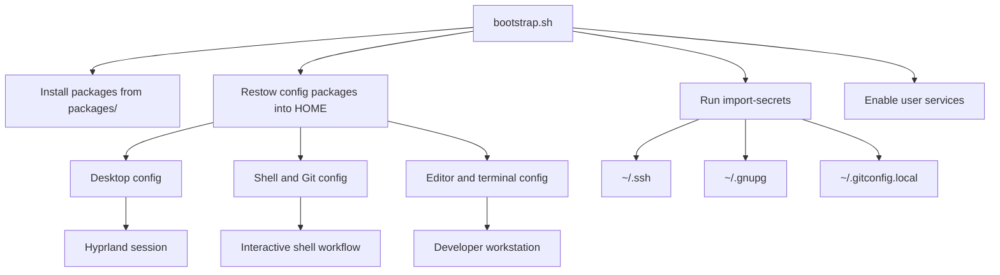
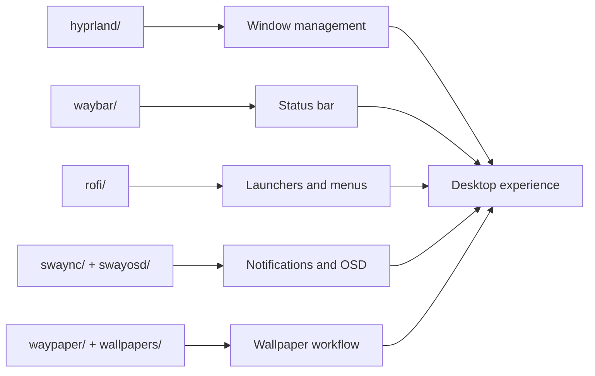
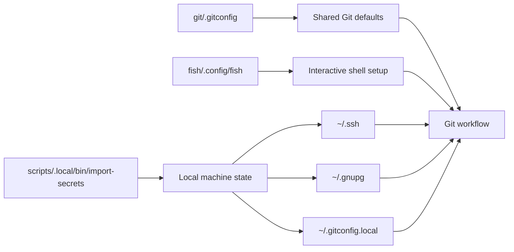

<!-- DO NOT TOUCH THIS SECTION#1: START -->
<div align="center">
  <h1>moshpitcodes.arch</h1>
  <p>Opinionated Arch/CachyOS dotfiles for a Hyprland desktop and developer workstation.</p>

  [](https://github.com/MoshPitCodes/moshpitcodes.arch)
</div>

<br/>
<!-- DO NOT TOUCH THIS SECTION#1: END -->

# 🗃️ Overview

`moshpitcodes.arch` is a GNU Stow-based dotfiles repo for a Hyprland setup with batteries-included shell, editor, theming, and desktop automation. It keeps shared config in the repo and pushes machine-specific identity and secrets into local files at setup time.

<br/>

## 📚 Project Structure

- `hyprland/`, `hypridle/`, `hyprlock/` - compositor, idle, and lockscreen config
- `waybar/`, `rofi/`, `swaync/`, `swayosd/`, `waypaper/` - desktop UI and interaction layer
- `fish/`, `git/`, `gnome/`, `xdg/` - shell, Git, GTK, and shared desktop defaults
- `neovim/`, `vscode/`, `tmux/`, `foot/`, `ghostty/`, `micro/` - developer environment
- `scripts/` - local utilities, bootstrap helpers, and user services
- `packages/` - pacman, AUR, Flatpak, and VS Code extension manifests
- `docs/templates/` - local config templates such as `secrets.env`

<br/>

## 📓 Project Components

| Component | Responsibility |
| --------------------------- | :---------------------------------------------------------------------------------- |
| **Bootstrap** | Installs packages, restows dotfiles, and runs local import helpers. |
| **Desktop Session** | Configures Hyprland, bars, notifications, wallpapers, launchers, and lockscreen behavior. |
| **Shell & Git** | Sets up Fish, Starship, Git defaults, SSH signing, and credential flow. |
| **Editors & Terminals** | Configures Neovim, VS Code, Micro, tmux, Foot, and Ghostty. |
| **Local Imports** | Imports SSH keys, GPG data, and machine-specific Git identity into the home directory. |

<br/>

# 📐 Architecture







<br/>

# 🚀 **Getting Started**

> [!CAUTION]
> These dotfiles modify your desktop session, shell behavior, editor defaults, and user-level services. Review the repo before applying it on a machine you care about.

> [!WARNING]
> Paths, hosts, secrets sources, monitor layouts, and app choices are personal defaults. Adjust them before running the full bootstrap.

<br/>

## 1. **Requirements**

### Prerequisites

- Arch Linux or CachyOS
- `git`
- working network access
- sudo access for package installation

### Installation

1. Clone the repository.
2. Review `bootstrap.sh`, `packages/`, and `docs/templates/secrets.env.template`.
3. Populate your local `secrets.env` file.
4. Run `./bootstrap.sh`.

<br/>

## 2. **Clone**

```bash
git clone https://github.com/MoshPitCodes/moshpitcodes.arch
cd moshpitcodes.arch
```

<br/>

## 3. **Local Setup**

> [!TIP]
> Treat SSH keys, GPG data, and Git identity as local machine state. Import them into your home directory instead of storing them in the repository.

### Secrets

Copy `docs/templates/secrets.env.template` to `~/.config/moshpitcodes/secrets.env` and fill in your local values for:

- `SSH_SOURCE_DIR`
- `SSH_KEYS`
- `GPG_SOURCE_DIR`
- `GIT_USER_NAME`
- `GIT_USER_EMAIL`

<br/>

### Bootstrap

Run the full setup:

```bash
./bootstrap.sh
```

Or restow an individual package:

```bash
stow --target="$HOME" --restow hyprland
```

<br/>

### Git Identity

Generate local Git identity from your configured values:

```bash
import-secrets --git-only
```

Verify it with:

```bash
git config --get user.name
git config --get user.email
```

<br/>

# 📝 Notes

<details>
<summary>
Host overlays
</summary>

`hyprland/.config/hypr/host.conf` selects the active host profile, and `hyprland/.config/hypr/hosts/` contains the per-machine overrides.

</details>

<details>
<summary>
Secrets handling
</summary>

`import-secrets` imports SSH keys to `~/.ssh`, GPG data to `~/.gnupg`, and local Git identity to `~/.gitconfig.local`. Those files are intended to stay outside version control.

</details>

<details>
<summary>
Repository governance
</summary>

GitHub rulesets, templates, and ownership files live in `.github/` so the repo can be managed through pull requests and signed commits.

</details>

<br/>

# 👥 Credits

Other resources and links:

  - [Hyprland](https://hypr.land/): Wayland compositor used by this setup
  - [GNU Stow](https://www.gnu.org/software/stow/): dotfile deployment mechanism

<br/>

<!-- DO NOT TOUCH THIS SECTION#2: START -->
<!-- # ✨ Stars History -->

<br/>

<p align="center"></p>

<br/>

<p align="center"></p>

<!-- end of page, send back to the top -->

<div align="right">
  <a href="#readme">Back to the Top</a>
</div>
<!-- DO NOT TOUCH THIS SECTION#2: END -->

<!-- Links -->
[Hyprland]: https://hypr.land/
