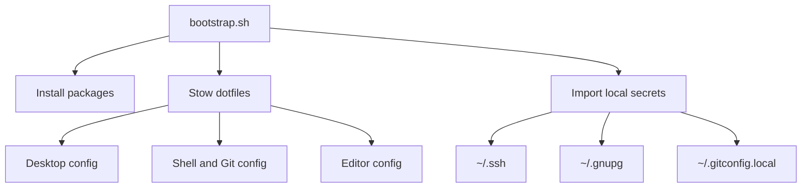

<!-- DO NOT TOUCH THIS SECTION#1: START -->
<div align="center">
  <h1>moshpitcodes.arch</h1>
  <p>Personal Arch/CachyOS dotfiles for a Hyprland desktop.</p>

  [](https://github.com/MoshPitCodes/moshpitcodes.arch)
</div>

<br/>
<!-- DO NOT TOUCH THIS SECTION#1: END -->

# 🗃️ Overview

`moshpitcodes.arch` is a Stow-managed dotfiles repo for a Hyprland-based Arch/CachyOS setup. It bundles desktop configuration, shell/editor tooling, bootstrap scripts, and small local setup helpers.

<br/>

## 📚 Project Structure

- `hyprland/` - Hyprland config, host overlays, keybinds, and startup behavior
- `scripts/` - local CLI helpers and user systemd units
- `packages/` - package manifests for pacman, AUR, Flatpak, and VS Code extensions
- `gnome/`, `rofi/`, `waybar/`, `waypaper/` - desktop theming and app configuration
- `git/`, `fish/`, `foot/`, `ghostty/`, `tmux/`, `neovim/`, `vscode/` - developer environment config
- `docs/templates/` - local setup templates for secrets and project docs

<br/>

## 📓 Project Components
| Component | Responsibility |
| --------------------------- | :---------------------------------------------------------------------------------- |
| **Bootstrap** | Installs packages, restows dotfiles, and runs local setup helpers. |
| **Desktop** | Configures Hyprland, notifications, bars, wallpaper, lockscreen, and theming. |
| **Shell & Git** | Sets up Fish, Starship, Git defaults, SSH signing, and local identity hooks. |
| **Editors** | Configures Neovim, VS Code, Micro, and terminal tooling. |
| **Secrets Import** | Pulls SSH, GPG, and local Git identity from machine-specific locations. |

<br/>

# 📐 Architecture

```text
packages/ -----> bootstrap.sh -----> stow packages into $HOME
                         |
                         +-----> scripts/.local/bin/import-secrets
                         |
                         +-----> user services / desktop helpers

hyprland/ + waybar/ + rofi/ + waypaper/ ---> desktop session
fish/ + git/ + ssh/ + gpg/               ---> shell and Git workflow
neovim/ + vscode/ + tmux/                ---> dev environment
```



<br/>

# 🚀 **Getting Started**

> [!CAUTION]
> These dotfiles change desktop, shell, and system-adjacent user configuration. Review anything you do not understand before applying it.

> [!WARNING]
> You should adjust host-specific paths, secrets sources, and application choices before using this setup on another machine.

<br/>

## 1. **Requirements**

### Prerequisites

- Arch or CachyOS
- `git`
- network access for package installation

### Installation

1. Clone the repository.
2. Review `packages/`, `bootstrap.sh`, and `docs/templates/secrets.env.template`.
3. Run `./bootstrap.sh`.
<br/>

## 2. **Clone**

```bash
git clone https://github.com/MoshPitCodes/moshpitcodes.arch
cd moshpitcodes.arch
```

<br/>

## 3. **Local Setup**
> [!TIP]
> Keep private keys and machine-specific identity outside the repository. Use the provided template and importer instead of committing secrets.

### Secrets

Copy `docs/templates/secrets.env.template` to `~/.config/moshpitcodes/secrets.env`, then fill in your local SSH, GPG, and Git identity values.

<br/>

### Bootstrap

Run `./bootstrap.sh` for the full setup, or use `stow --target="$HOME" --restow <package>` for individual packages.

<br/>

### Git Identity

Run `import-secrets --git-only` to generate `~/.gitconfig.local` from your local config values.

<br/>

# 📝 Notes

<details>
<summary>
Hosts
</summary>

`hyprland/.config/hypr/host.conf` selects the active host overlay.

</details>

<details>
<summary>
Secrets
</summary>

SSH and GPG material are imported into your home directory and are meant to stay out of git.

</details>

<details>
<summary>
Rulesets
</summary>

Repository governance rules live in `.github/rulesets/`.

</details>
<br/>

# 👥 Credits

Other resources and links:

  - [Hyprland](https://hypr.land/): Wayland compositor used by this setup
  - [GNU Stow](https://www.gnu.org/software/stow/): dotfile deployment mechanism

<br/>

<!-- DO NOT TOUCH THIS SECTION#2: START -->
<!-- # ✨ Stars History -->

<br/>

<p align="center"></p>

<br/>

<p align="center"></p>

<!-- end of page, send back to the top -->

<div align="right">
  <a href="#readme">Back to the Top</a>
</div>
<!-- DO NOT TOUCH THIS SECTION#2: END -->

<!-- Links -->
[Hyprland]: https://hypr.land/
